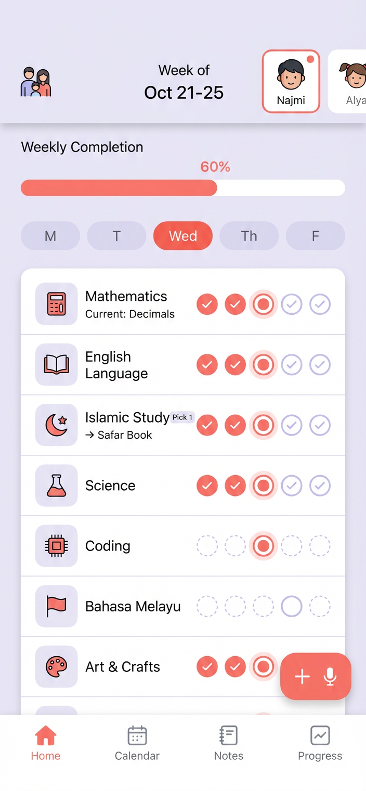
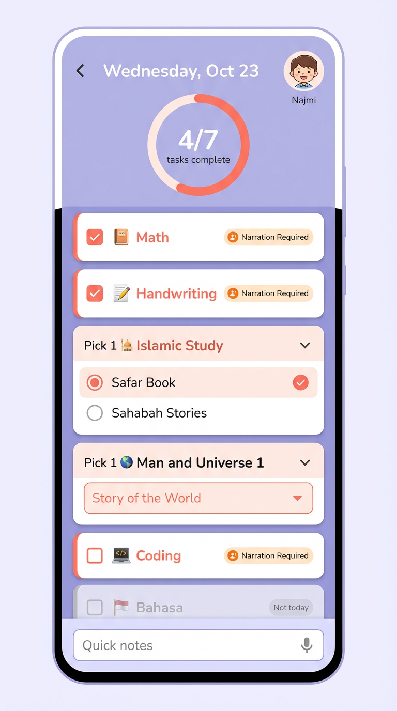
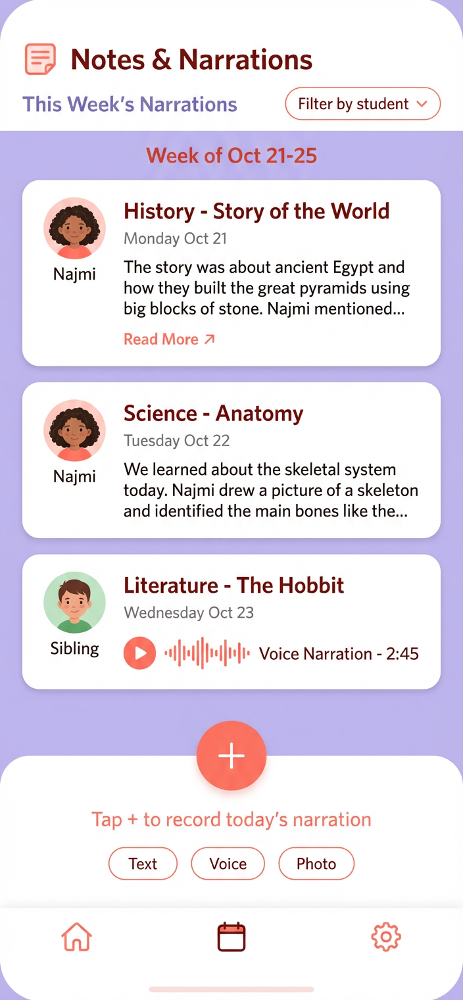
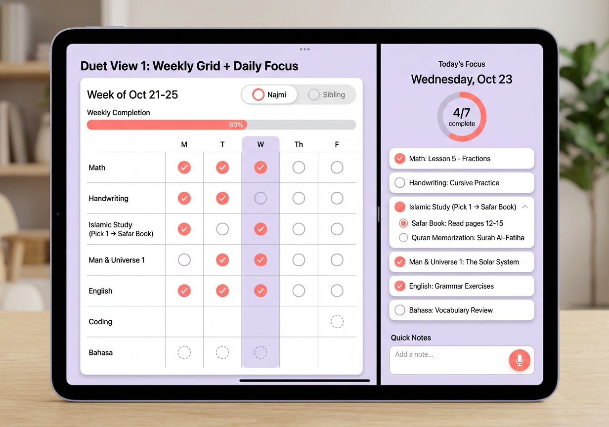

# Homeschool Planner

A weekly planning app for homeschooling families, designed for a teacher (mom) and two children (ages 11 & 8).

## Vision

Replace paper-based weekly planners with a digital tool that:

- Tracks daily subject completion across the week
- Supports "Pick 1" subject categories (choose one resource per category)
- Handles day-specific subjects (e.g., Coding only Mon-Thu)
- Captures narrations (text, voice, photo) as learning evidence
- Works seamlessly on both mobile phones and iPads

## Target Users

| User       | Role                    | Primary Device |
| ---------- | ----------------------- | -------------- |
| Mom        | Teacher / Administrator | iPad           |
| Najmi (11) | Student - Year 6        | iPad           |
| Isa (8)    | Student - Year 3        | iPad           |

## UI Mockups

### Mobile Views

#### 1. Weekly Overview



- Student selector tabs with avatars
- Weekly completion progress bar
- Day selector pills (M-T-W-Th-F)
- Subject rows with 5-day checkmark grid
- "Pick 1" subjects show current selection
- Day-specific subjects show dashed circles on off-days
- Floating action button for notes/voice

#### 2. Daily Focus



- Progress ring showing tasks complete
- Task cards with checkboxes
- Expandable "Pick 1" categories with radio options
- Dropdown selectors for multi-option subjects
- "Not today" label for scheduled-only subjects
- "Narration Required" badges
- Quick notes input with voice option

#### 3. Notes & Narrations



- Filter by student
- Narration cards with previews
- Support for Text, Voice, and Photo
- Voice playback for audio recordings

### iPad Views

#### 4. Duet View (Weekly Grid + Daily Focus)



- Split-screen layout (60/40)
- Left: Full weekly grid with all subjects and days
- Right: Today's focus with task details
- Student tabs for switching between children
- Quick notes section with voice input

## Design System

### Colors

| Name      | Hex       | Usage                                |
| --------- | --------- | ------------------------------------ |
| Lavender  | `#E8E4F0` | Background                           |
| Coral     | `#F08080` | Primary accent, checkmarks, progress |
| White     | `#FFFFFF` | Cards, panels                        |
| Dark Gray | `#333333` | Text                                 |

### Typography

- **Headings**: System font, semibold
- **Body**: System font, regular
- **Touch targets**: Minimum 44x44pt

## Core Features (v1)

### 1. Weekly Schedule Grid

- Display subjects as rows, days as columns
- Track completion with checkboxes
- Highlight current day
- Show weekly progress percentage

### 2. Subject Types

| Type           | Behavior                                                      |
| -------------- | ------------------------------------------------------------- |
| Fixed Daily    | Checkbox every day (Math, Handwriting)                        |
| Scheduled Days | Active only on specific days (Coding: Mon-Thu)                |
| Pick 1         | Select one sub-item per category (Islamic Study → Safar Book) |

### 3. Learning Contexts

The app supports multiple learning contexts beyond individual students:

| Context | Code | Participants | Examples |
|---------|------|--------------|----------|
| **Individual** | (N), (I) | Single student | Math, Daily Report |
| **Family Study** | (F) | All children together | Picture Study, Nature Study, 99 Names of God |
| **Joint Tutoring** | (N&I) | Specific subset | Foreign Language, Map Drilling |

Key behaviors:
- **Same subject can be individual or group** - Tutoring mode depends on teacher availability
- **Group subjects produce individual artifacts** - Family Study yields different narrations per student
- **Pick1 subjects need balance tracking** - Teacher sees which books have been used to ensure coverage

See [ADR 004: Teachable Delegated Type](decisions/004-teachable-delegated-type.md) for the data model.

### 4. Student Profiles

- Multiple students per family
- Separate curriculum per student
- Individual progress tracking
- Group memberships for Family Study and Joint Tutoring

### 5. Narrations

- Text, voice, or photo entries
- Linked to subject and date
- Filterable by student

### 6. Quick Notes

Quick Notes are **date-level observations** distinct from subject-attached Narrations:

| Feature         | Attached To    | Purpose                          | Examples                          |
| --------------- | -------------- | -------------------------------- | --------------------------------- |
| **Narrations**  | Subject + Date | Learning evidence for curriculum | "Tell me about the book you read" |
| **Quick Notes** | Date only      | Day-level observations           | "We visited the museum today"     |

Quick Notes capture day-level context like:

- "Field trip today"
- "Shortened lessons - dentist appointment"
- General reflections not tied to a specific subject

## Technical Architecture

### Stack

> **Note**: Original vision specified React. Actual implementation uses Rails 8 + Hotwire per [ADR-0002](decisions/0002-rails-for-simplicity-and-learning.md).

- **Framework**: Rails 8 with Hotwire (Turbo + Stimulus)
- **Database**: SQLite with ActiveRecord
- **Styling**: Tailwind CSS 4
- **Auth**: has_secure_password

### Data Model

See Architecture Decision Records for detailed data models:

- [ADR 003: Delegated Types for Recordables](decisions/003-delegated-types-for-recordables.md) - Recording → Narration/QuickNote
- [ADR 004: Teachable Delegated Type](decisions/004-teachable-delegated-type.md) - Teachable → Student/StudentGroup

```
┌─────────────────────────────────────────────────────────┐
│                      Teachable                          │
│  (user_id, name) → delegates to Student or StudentGroup │
└─────────────────────────────────────────────────────────┘
          │                              │
          ▼                              ▼
┌─────────────────────┐      ┌─────────────────────────┐
│      Student        │      │     StudentGroup        │
│  (avatar, year)     │◄────►│  (family, joint)        │
└─────────────────────┘      └─────────────────────────┘
          │
          ▼
┌─────────────────────────────────────────────────────────┐
│                      Recording                          │
│  (student_id, date) → delegates to Narration/QuickNote  │
└─────────────────────────────────────────────────────────┘

Teachable has_many :subjects
Subject has_many :completions
Student has_many :recordings (artifacts always individual)
```

## Responsive Behavior

| Breakpoint | Layout                                   |
| ---------- | ---------------------------------------- |
| < 768px    | Mobile: single column, bottom nav        |
| ≥ 768px    | Tablet: split view (Duet), no bottom nav |

## Future Considerations (v2+)

- Cloud sync across devices
- Teacher review/approval workflow
- Weekly/monthly reports
- Streak tracking and gamification
- Multiple family support
- Curriculum templates

## Reference Documents

The app digitizes these paper-based planners:

| Document | Purpose |
|----------|---------|
| [Najmi - Daily Work Year 6 Term 1.pdf](examples/Najmi%20-%20Daily%20Work%20Year%206%20Term%201.pdf) | Individual student tracking (Year 6) |
| [Isa - Daily Work Year 3 Term 1.pdf](examples/Isa%20-%20Daily%20Work%20Year%203%20Term%201.pdf) | Individual student tracking (Year 3) |
| [Family Studies and Tutoring Schedule.pdf](examples/Family%20Studies%20and%20Tutoring%20Schedule.pdf) | Family Study (F) and Tutoring (N, I, N&I) schedule |

---

_Document created: January 2026_
